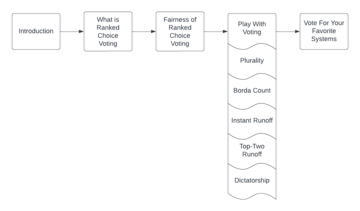

This project is an interactive dynamic website, found at [https://tinyurl.com/KnowYourVotingSystems](https://tinyurl.com/KnowYourVotingSystems), that aims to educate users on ranked choice voting systems and their fairness. We structured the website as portrayed in the following flowchart below, which we believe provides an effective educational experience.

Overall, we discuss five different kinds of voting systems: plurality, Borda count, instant runoff, top two runoff, and dictatorship. For each voting system we explain how they work and whether or not they satisfy certain fairness criteria. We also implement functions that run each voting system on a [dataset](https://dataverse.harvard.edu/file.xhtml?fileId=6377197&version=5.0) of ranked choice votes from the Alaska 2020 Democratic primary. Users of the website are able to see the results and, to a certain extent, modify the voting systems to see how results change. At the end, we allow users to vote on their favorite voting systems and see which voting system is the collective favorite based on each voting system, in a somewhat meta fashion.

There are three technical components constituting the project:
- We use SQL by means of sqlite3 to create a database that stores the Alaska voting data as well as the website users’ votes on their favorite voting systems. We then implement the voting systems as functions that rely on SQL queries.
- We construct a complex data visualization (namely, a sankey diagram) using plotly to better portray the results of instant runoff on the Alaska data. We also write code which can display the results of other voting systems as bar graphs.
- We use Flask, HTML, and CSS to implement the front end of the website, ensuring that it is a functional dynamic website.

We explain each component in further detail in this the [blog post](https://najisarsam.quarto.pub/najis-pic16-blog/posts/Project/). As a brief summary, this project includes
- the `voting_systems.py` module containing functions for storing and analyzing election data in a SQL database. Implementations of the voting systems plurality, Borda count, instant runoff, top two runoff, and dictatorship are found in this module;
- the `plot_data.py` and `get_data.py` modules containing functions for creating visualizations of the voting systems results;
- the `app.py` module containig the functions for rendering the website via Flask;
- the `templates` folder containing the html templates for each page of the website;
- and the `static` folder containing the css file determining the aesthetics of the website.